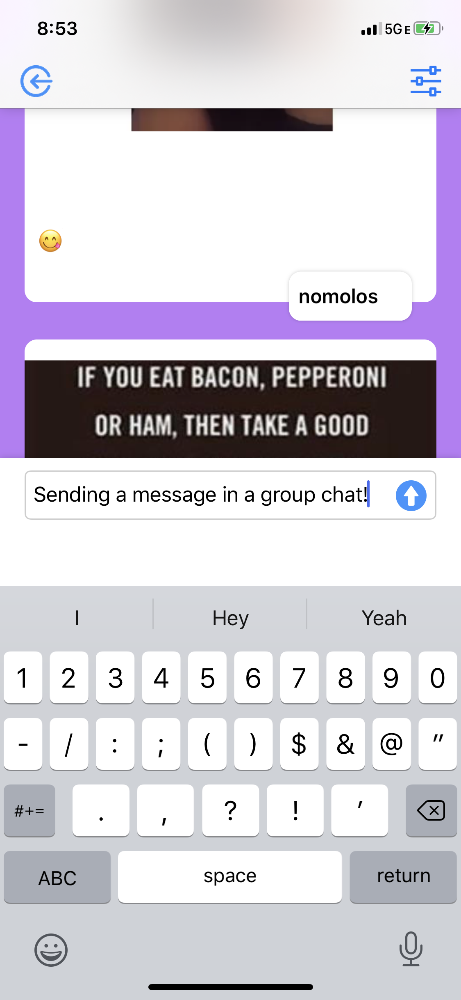

memedex is an open-source meme catalog powered by artificial intelligence. As you 'rate' individual memes (using a slider), memedex gets better at identifying your preferences. Each day memedex searches the internet for the latest memes and finds some specifically for you! Memedex also supports group chats for sharing memes with friends. It is completely free and there are no ads. Available only on iPhone/iPad (for now). 

### Download link :
https://apps.apple.com/us/app/memedex/id1513434848

### Screenshots from the app :
  

### Interested in contributing or have feedback/ideas?

Reach out to me (Solomon) @ memedex2020@gmail.com

### What to expect in early September 2020

- Better meme recommendation
- Tutorial for beginners
- More meme variety
- Usability improvements
